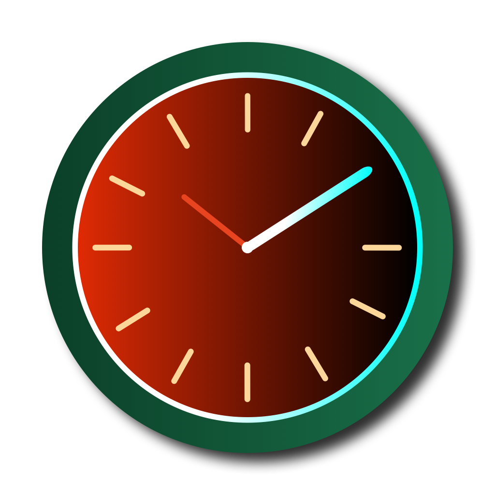

<html lang="en">
<head>
    <meta charset="UTF-8">
    <title>Pomo Tasks</title>
    <link href="https://fonts.googleapis.com/css2?family=Montserrat:wght@400;700&display=swap" rel="stylesheet">
    
    

    

</head>

<body>

    
    <h1>Welcome to the Pomodoro Timer App!</h1>
    
This Privacy Policy explains how we collect, use, disclose, and safeguard your information when you use our mobile application. Please read this policy carefully. If you disagree with its terms, please discontinue use of the application immediately.

    <h2>Data Collection and Use</h2>
    
This app only collects data necessary for the payment process and for basic functionality of the application. We do not collect personal data outside of this scope.

    
The data is only collected when you manually input it during the payment process.

    
We use a third-party payment processing service called Revenue Cat to handle transactions. As such, some of your information may be shared with Revenue Cat during the transaction process. We recommend reviewing Revenue Cat’s privacy policy to understand how they use and protect your information.

    <h2>User Rights</h2>
    
As we do not collect or store personal data beyond what is necessary for the payment process, user rights pertaining to data access, modification, or deletion may be limited. For any concerns or requests related to your data, please contact us directly.

    <h2>Data Security</h2>
    
Your payment data is secure as it is processed through Revenue Cat, a third-party payment processing service, which implements its own security measures. We do not handle or store this data on our servers.

    <h2>Children’s Privacy</h2>
    
Our application is intended for a general audience and does not knowingly collect or solicit personal information from anyone under the age of 13.

    <h2>International Data Transfers</h2>
    
We do not transfer data internationally.

    <h2>Changes to Privacy Policy</h2>
    
We may update this Privacy Policy as necessary. Any updates will be notified through the app.

    <h2>Device Permissions</h2>
    
For the optimal functioning of the app, we require certain permissions from your device, such as access to notifications and live activities. These permissions do not involve access to your personal data and are solely used to ensure proper app functionality.

    <h2>Contact Us</h2>
    
For any questions or concerns about this Privacy Policy, please contact us at:

    
Email: pomotasks25@gmail.com

    
Phone: +48 797543138

    <h2>Support</h2>
    
If you encounter any issues while using our app or have any other concerns that need our assistance, you can contact our support team. We're here to help you!

    
Here are the ways you can reach us:

    <h3>Email</h3>

For any general queries or technical support, please email us at <a href="mailto:pomotasks25@gmail.com">pomotasks25@gmail.com</a>. We aim to respond to your inquiries within 48 hours.

    <h3>Phone</h3>

You can also reach out to us via phone at +48 797 543 138. Our support team is available from Monday to Friday, 9:00 AM to 5:00 PM (Central European Time).

<a href="#" class="top-btn">⬆</a>
<a href="#" class="last-updated-btn" data-date="Last Updated: July 26, 2023">Last Updated</a>
<button class="dark-light-btn" title="Toggle Dark/Light Mode">🌓</button>

</body>

</html>
